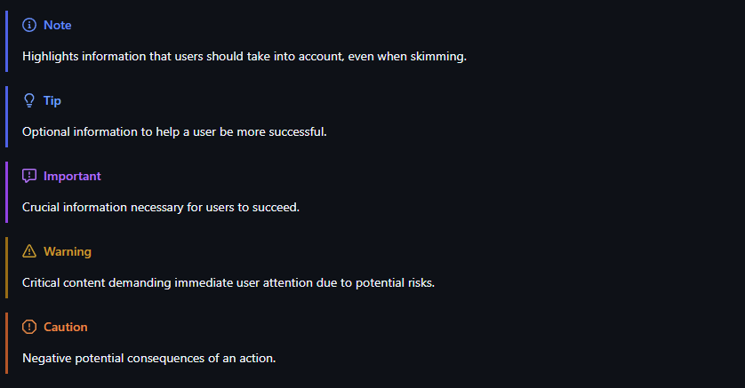

# Titulo1
Hola me llamo Jairo
1. **Texto en negrita**
2. `Texto de código`
---
- Esto de un bullet
- [ ] soy un checkbox vacío
- [x] soy un checkbox relleno

## Titulo 2
```python
import os

def main():
    print("hola")
```
### Titulo 3

[esto es un enlace](doc1.md)

#### Titulo 4
|nombre columna 1|nombre columna 2|nombre columna 3|
|---|---|---|
|hola|soy|jairo|


---

> Esto es una nota, se ve como así un poco rellena
sigo con otra linea
> y otra linea

> Esto ya sí es otra nota, y no seguir en con nuevas líneas

$$
E = mc^2
$$

# Tips para las notas

> [!NOTE]  
> Highlights information that users should take into account, even when skimming.

> [!TIP]
> Optional information to help a user be more successful.

> [!IMPORTANT]  
> Crucial information necessary for users to succeed.

> [!WARNING]  
> Critical content demanding immediate user attention due to potential risks.

> [!CAUTION]
> Negative potential consequences of an action.